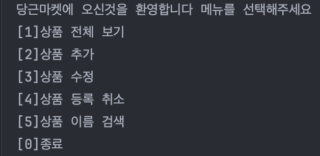
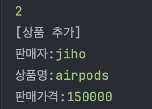
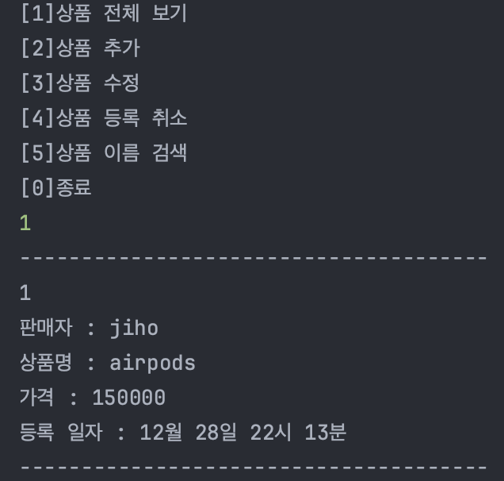
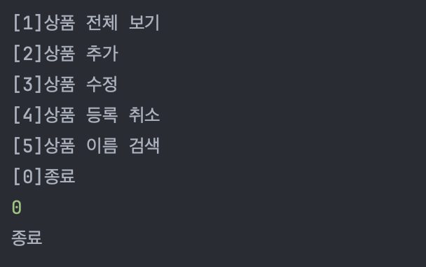

## 주제 : 당근마켓 CRUD 기능 구현

#### 조건

-[ ] ArrayList, Scanner, BufferedReader, DateTimeFormatter class 사용
-[x] 조회할 때 데이터 처음 번호는 1번 부터
-[x] 수정, 삭제시 조회 메뉴의 리스트를 보여준 후 원하는 번호를 입력받은 후 번호에 해당하는 데이터를 수정이나 삭제 기능 구현

#### 주요 기능

-[ ] 조회 (상품 조회)
  - [x] 등록된 상품 들을 모두 출력 한다
  - [x] 각 제품별 줄바꿈 처리를 한다
  - [x] 가격, 상품명, 등록 일자 그리고 판매자를 모두 출력 한다. 
  - [ ] 가격과 등록 일자 순으로 정렬할 수 있도록 구현 한다. (기본은 등록 일자 순, 가격은 낮은 순)
-[x] 추가 (상품 추가)
    - [x] 판매자, 가격, 상품명 그리고 등록 일자 모두 입력 받는다.
    - [x] 상품 가격은 0원부터 1억원(100000000)이하의 값으로 설정 한다. 
    - [x] DateTimeFormatter 사용하여 날짜 관리
-[x] 수정 (상품 수정)
    - [x] 판매자를 입력 받고 판매자를 등록한 모든 상품 목록을 출력 한다.
      - [x] 수정할 상품의 index를 입력 받는다.
      - [x] 수정할 상품의 가격, 상품명, 등록 일자 그리고 판매자를 입력 받는다.
-[x] 삭제 (상품 삭제)
    - [x] 판매자를 입력 받고 판매자가 등록한 모든 상품 목록을 출력 한다.
    - [x] 삭제할 상품의 index를 입력 받는다.
    - [x] 삭제 경고 문구가 출력 되고 "Yes"를 입력 받으면 삭제 한다.
    - [ ] 앞의 요소가 삭제 된다면 index 자동으로 정렬 되도록
-[ ] 검색 (상품 검색)
    - [x] 상품 명을 입력 받아 일치 하는 상품이 있을 경우 출력 한다.
    - [x] 상품명이 동일한 상품이 있을 경우 가격 낮은 순으로 정렬 하여 출력 한다.
        - [ ] 상품과 가격이 모두 동일 하다면 등록 일자 순으로 정렬 하여 출력 한다.
-[ ] 종료
    - [x] 종료 경고 문구가 출력 되고 "Yes"를 입력 받으면 삭제 한다.

#### 예외 처리

- [x] 상품 가격이 0원부터 1억원(100000000)이하의 값이 아니 라면 에러 메시지를 출력 하고 다시 입력 받는다.
- [X] 공백이 입력되면 에러 메시지를 출력하고 다시 입력 받는다.
  - [x] 상품 수정에서는 수정할 내용이 아닌 내용은 공백 처리 가능
- [x] 등록된 상품이 없을때 상품 전체 보기를 선택하면 에러 메시지 출력

#### 추가 구현 사항

- [ ] db 연결
  - [ ] id index 로직 수정
  - [ ] 등록 일자, 가격 순 정렬
- [ ] File IO

---

### Classes

- constant
  - Constant : 자주 사용 되는 숫자를 관리
  - ErrorMessage(Enum) : 잘못된 입력을 받았을 때 출력할 에러 메세지를 관리
- controller
  - KarrotMarketController : 입력값에 따른 프로그램의 전체적인 실행을 관리
- crud
  - Create : 상품 추가 기능
  - Read : 상품 이름 검색 기능
  - Update : 상품 수정 기능
  - Delete : 상품 등록 취소 기능
- view
  - InputView : 사용자 입력과 예외 처리
  - OutputView : 화면에 보여지는 출력을 담당
- item : 상품 데이터 관리
- Main : 프로그램 시작과 controller와의 연결 다리 역할

### 실행 화면

### 느낀점

- 기능별로 메서드를 나누고 한 메서드는 한가지 기능만 구현할 수 있도록 분리하다 보니 구현에 꽤 오랜 시간이 소요 되었습니다.
- 입력값에 대한 예외 처리를 했는데 어느 정도까지 예외처리를 하는게 적절한지 고민이 되었습니다.
- MVC 패턴의 개념을 적용하려고 노력 했는데 아직 정확히 이해 하지 못하고 구현한 것 같습니다.
- 모든 문자열과 숫자를 상수로 처리 했는데 이렇게 모두 처리하는것이 좋은것인지에 대한 고민을 했습니다.
- 변수와 메서드명을 보면 딱 어떤 기능을 하는 것인지 알 수 있도록 고민했는데 여전히 비슷하거나 적절하지 못한 네이밍이 있었던 것 같습니다.
- 프로그램의 확장성을 생각하면서 구현하려고 노력했지만 잘 안된것같습니다.