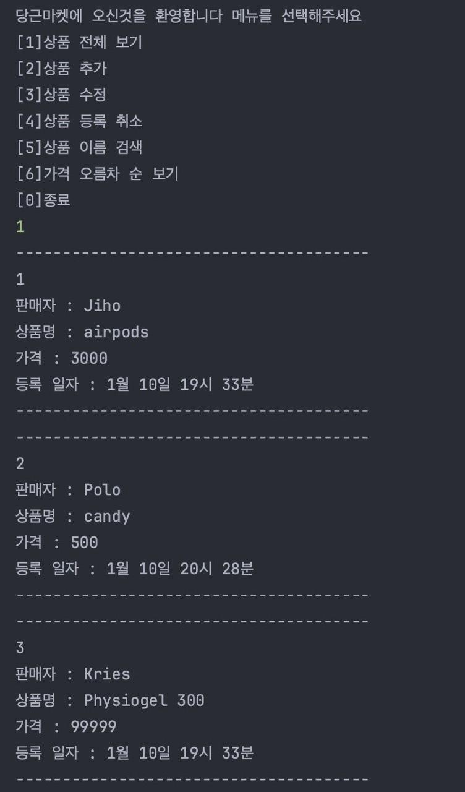
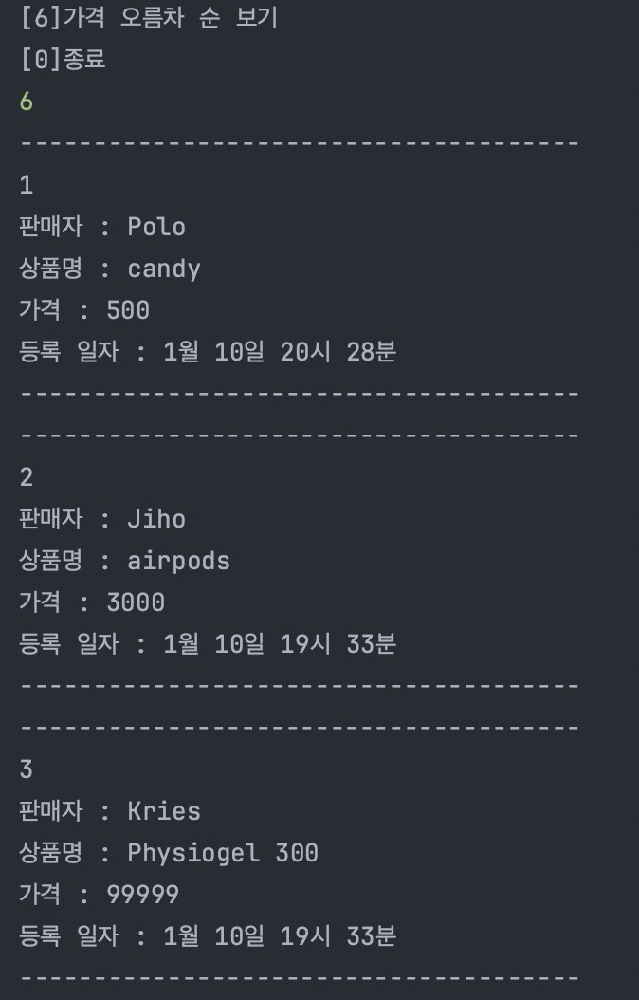

## 주제 : 당근마켓 CRUD 기능 구현 + SQLite

## 참고 사이트 (당근 마켓)
  - https://www.daangn.com/fleamarket/

#### 조건
- [ ] ArrayList, Scanner, BufferedReader, DateTimeFormatter class 사용
- [x] 조회할 때 데이터 처음 번호는 1번 부터
- [x] 수정, 삭제시 조회 메뉴의 리스트를 보여준 후 원하는 번호를 입력받은 후 번호에 해당하는 데이터를 수정이나 삭제 기능 구현

#### 주요 기능
- [X] 조회 (상품 조회)
  - [x] 등록된 상품 들을 모두 출력 한다
  - [x] 각 제품별 줄바꿈 처리를 한다
  - [x] 가격, 상품명, 등록 일자 그리고 판매자를 모두 출력 한다. 
- [x] 추가 (상품 추가)
    - [x] 판매자, 가격, 상품명 그리고 등록 일자 모두 입력 받는다.
    - [x] 상품 가격은 0원부터 1억원(100000000)이하의 값으로 설정 한다. 
    - [x] DateTimeFormatter 사용하여 날짜 관리
- [x] 수정 (상품 수정)
    - [x] 판매자를 입력 받고 판매자를 등록한 모든 상품 목록을 출력 한다.
      - [x] 수정할 상품의 index를 입력 받는다.
      - [x] 수정할 상품의 가격, 상품명, 등록 일자 그리고 판매자를 입력 받는다.
- [x] 삭제 (상품 삭제)
    - [x] 판매자를 입력 받고 판매자가 등록한 모든 상품 목록을 출력 한다.
    - [x] 삭제할 상품의 index를 입력 받는다.
    - [x] 삭제 경고 문구가 출력 되고 "Yes"를 입력 받으면 삭제 한다.
    - [x] 앞의 요소가 삭제 된다면 index 자동으로 정렬 되도록
- [X] 검색 (상품 검색)
    - [x] 상품 명을 입력 받아 일치 하는 상품이 있을 경우 출력 한다.
- [x] 종료
    - [x] 종료 경고 문구가 출력 되고 "Yes"를 입력 받으면 삭제 한다.

#### 예외 처리
- [x] 상품 가격이 0원부터 1억원(100000000)이하의 값이 아니 라면 에러 메시지를 출력 하고 다시 입력 받는다.
- [X] 공백이 입력되면 에러 메시지를 출력하고 다시 입력 받는다.
  - [x] 상품 수정에서는 수정할 내용이 아닌 내용은 공백 처리 가능
- [x] 등록된 상품이 없을때 상품 전체 보기를 선택하면 에러 메시지 출력

#### 추가 구현 사항
- [x] db 연결
  - [x] id index 로직 수정
  - [X] 가격 순 정렬
  - [x] sqlite3 데이터 관리

---

### Classes

- constant
  - Constant 사용 되는 숫자 데이터 관리
  - DBdata DB 연결시 필요한 데이터 관리
  - ErrorMessage 잘못된 입력값에 따른 에러 메세지 관리
- controller
  - KarrotMarketController 입력값에 따른 프로그램 흐름 관리
- crud (DML,DQL 생성으로 인해 controller 역할이 되었음)
  - Create
  - Delete
  - Read
  - Update
- database
  - DBConnection DB 연결 관리
  - DMLService 데이터 추가, 삭제, 수정 쿼리 관리
  
  - ~~~
    static final String ITEM_INSERT = "insert into karrotItem (seller, price, itemName, dateTime) " + "values (?,?,?,?) ";
    static final String ITEM_DELETE = "delete from karrotItem where id = ? ";
    static final String ITEM_UPDATE = "UPDATE karrotItem SET seller = ?, price = ?, itemName = ?, dateTime = ? WHERE id = ?";
    
  - DQLService 데이터 검색 쿼리 관리
  
  - ~~~
    static final String SELECT_ALL = "select * from karrotItem ";
    static final String SELECT_INCLUDE_NAME = "select * from karrotItem where itemName like '%' || ? || '%' order by id";
    static final String SELECT_ORDERED_INCREASING = "select * from karrotItem order by price ASC";

- view
  - InputView 사용자 입력 관리
  - OutputView 화면에 보여지는 출력 관리
- Item 상품 데이터 관리
- Main 프로그램 시작과 controller와 연결 

### Database
- sqlite
- KarrotMarket
  - karrotItem
    - id
    - seller
    - itemName
    - price
    - dateTime

### 실행 화면

### 느낀점
- DML,DQL 등 처음 접하는 개념을 처음 봤을때 어떤 것이 어떤 기능을 하고 왜 나누어져있는지 이해를 잘 
하지 못했었는데 계속 보고 구현을 하다 보니 자연스럽게 이것들이 하는 역할 그리고 왜 나누는지에 대해서 이해할 수
있게 되었습니다. 아쉬운점은 기본적인 기능만 구현한점과 더불어 db table을 너무 간단하게 구성했다고 생각이 들어 어떠한 데이터가 관리
되면 좋을지에 대해서 더 생각해보고 발전시키도록 하겠습니다.